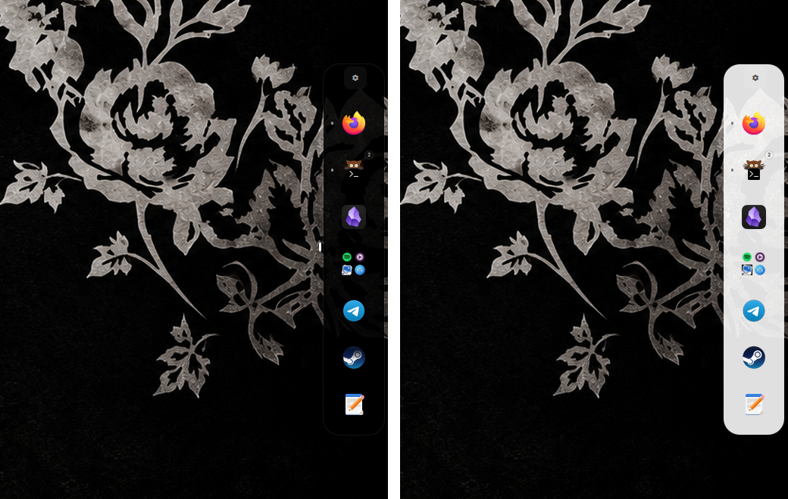
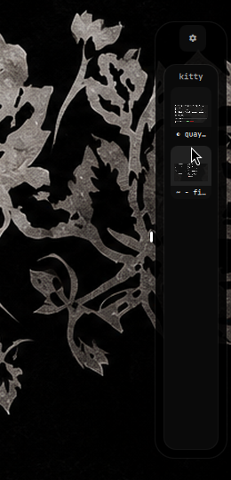
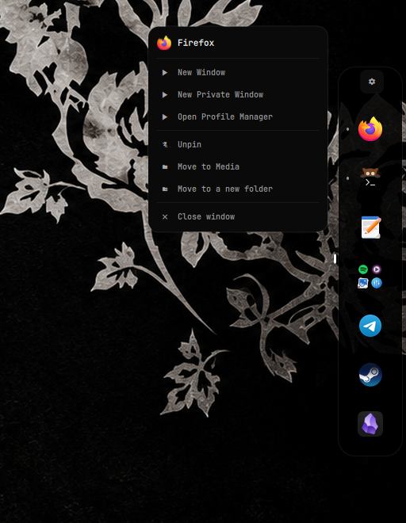
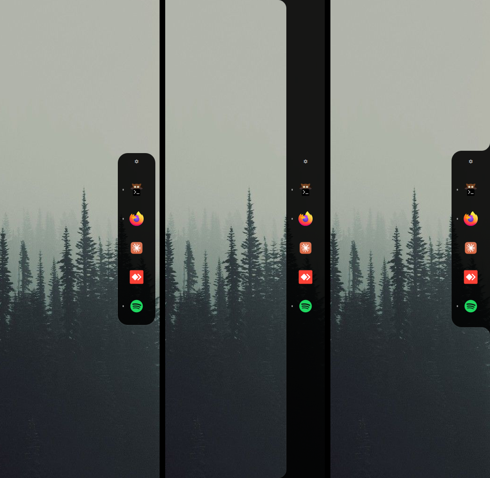
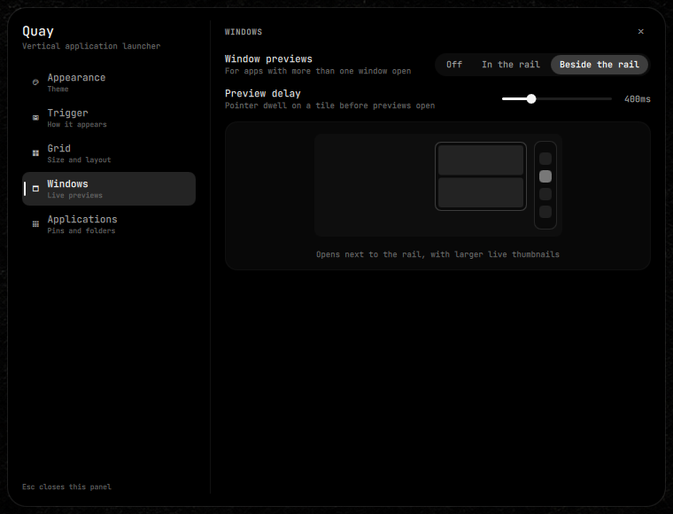

<div align="center">

<picture>
  <source media="(prefers-color-scheme: dark)" srcset="docs/logo-dark.svg">
  
</picture>

# Quay for Quickshell

A vertical, home-screen-style app launcher for Quickshell on Wayland — pinned
apps, folders and running windows in one rail that moves one row per wheel
notch.

[](https://quickshell.outfoxxed.me/)
[](https://wayland.app/protocols/wlr-layer-shell-unstable-v1)
[](LICENSE)

**[Website](https://lunanoir21.github.io/quickshell-quay/)** · [Türkçe README](README.tr.md)



</div>

---

## What it is

Quay is not a task switcher. It keeps *the apps you choose*, in the order you
choose, docked to an edge of the screen, and marks which of them are running —
the way a phone home screen does, turned on its side. One wheel notch moves one
row.

It is a self-contained Quickshell module: its own settings file, its own
settings panel, its own app index. Vendoring it into a shell takes one import
and one line.

<!-- changelog:readme:start -->
## What's new in 1.2.1

_Released 2026-09-16 · [Full changelog](CHANGELOG.md)_

**Security**

- **Unbounded application-directory scan.** `quay_app_fetcher.py` walked `~/.local/share/applications`, Flatpak and Nix profile directories — none of them fully under Quay's control — with no limit on file count, path depth, per-file size, line length or total bytes read, and no protection against a symlink cycle. A `.desktop`-named FIFO or socket could also hang the scan indefinitely. It's now bounded on every axis (20000 files, depth 20, 256 KiB/file, 8192 bytes/line, 32 MiB total), never descends into a symlinked directory, and opens each file with `O_NONBLOCK` plus an `fstat` check on the descriptor actually opened — not a separate, racy `stat()` of the path beforehand — so only a regular file is ever read, symlinks to one (Flatpak's exports directory is full of them) still work, and a FIFO returns instead of blocking. `QuayApps.qml` adds a second backstop: the scan is killed if it runs past 8 seconds, and output over 16 MiB is discarded unparsed.
- **Rich-text rendering of external strings.** A window title (set by whatever app owns the window), a `.desktop` entry's name, and an unmatched compositor app-id all reached `Text` elements with Qt Quick's default `Text.AutoText`, which renders a string that looks like markup as rich text. All of them now render as `Text.PlainText`; window titles and unmatched app-ids are also length-capped (300 and 200 characters) before display.

**Fixed**

- **The in-rail window preview could close itself.** Hovering it read, to the grid underneath, as the pointer having left — the close timer fired while the pointer was sitting on the preview the user was trying to use.
- **A stuck file-drag flag could hold the rail open indefinitely.** Dragging a file over a tile that the grid then recycled (`GridView.reuseItems`) left that tile's drag-hover flag on forever, since a pooled item never gets the drop area's own exit event.

**Changed**

- **Focusing any window no longer rebuilds Quay's whole running-apps model.** Which window is focused used to be folded into the same map that tracks which apps are running, so any focus change anywhere on the desktop — not just ones affecting a pinned or listed app — invalidated it and everything computed from it, icon lookups included.

<!-- changelog:readme:end -->

## Features

- **Vertical wheel navigation.** One notch, one row, with snap — whichever edge
  the rail is docked to.
- **Pinned apps and what else you want.** After your pins, the rail can list
  nothing, every other open window, or your most recently used apps.
- **Reads at a glance.** A short mark means running, a long mark means focused,
  a number counts an app's windows, and dots on the side show the page.
- **Live window previews.** Hold the pointer on an app with more than one window
  to see each one and pick it directly — beside the rail with larger thumbnails,
  or inside it — and close one from its thumbnail. A plain click still cycles
  through them.
- **A menu on every tile.** Right click for the app's own shortcuts (a private
  window, a new profile), a new window, pinning, moving it into a folder, or
  closing all its windows. Middle click opens a new window straight away.
- **Drop files on an app.** Drag a file onto a tile to open it with that app;
  in hover mode, carrying it to the edge brings the rail out.
- **Launch feedback.** A tile breathes until the app it started shows a window,
  and a second click in the meantime doesn't start it twice.
- **Out of the way in fullscreen.** While a focused window is fullscreen — a
  game, a video — the rail and its hot edge stand down.
- **Folders by drag and drop.** Drag a tile to move it; drop it onto another to
  make a folder.
- **Three ways to appear.** Always on screen, sliding in when the pointer reaches
  the edge, or opened with a key.
- **Floating, flush or bridge.** Keep the rail off the edge, run it along the
  whole edge as part of the screen's frame, or weld it to the edge with curved
  joins that grow out of a thin handle.
- **Never takes space.** Quay floats over your windows and reserves no exclusive
  zone, so nothing is resized when it appears.
- **Black, white, or the system's.** Pure monochrome either way, or following
  the system's light/dark preference live.
- **Its own settings panel.** Everything is configurable from the gear at the top
  of the rail — no host settings app needed.
- **Frame-time correct motion.** Drag autoscroll is integrated from real frame
  time, so it moves at the same speed on a 60 Hz panel and a 165 Hz one.

## A closer look

<p align="center">
  
  &nbsp;
  
</p>

<p align="center">
  
</p>

<p align="center">
  
</p>

Window previews beside the rail for an app with two windows, the tile menu, the
three rail styles — Floating, Flush and Bridge — and the Appearance section of
Quay's own settings panel. Captured on Hyprland at 1920×1080.

## Requirements

- [Quickshell](https://quickshell.outfoxxed.me) 0.3 or newer
- A Wayland compositor with `wlr-layer-shell` and
  `wlr-foreign-toplevel-management`: Hyprland (what Quay is developed on), Sway
  and other wlroots compositors, or niri. Without the second, running marks,
  window counts and previews stay empty.
- Window previews capture windows through Hyprland's toplevel export protocol,
  so with Quickshell 0.3 they show on Hyprland only.
- A [Nerd Font](https://www.nerdfonts.com) installed, for the interface icons
  (the gear, menus and settings); without one they show as empty boxes.
- `python3`, `jq`, `bash` and `flock` (util-linux)
- Optional: `wl-copy`, for the settings panel's copy button
- Optional: `gdbus` (glib2) and xdg-desktop-portal, for the System theme

## Install

### Into your own Quickshell config

```sh
cd ~/.config/quickshell
git submodule add https://github.com/lunanoir21/quickshell-quay.git vendor/quay
```

Then load it from your shell root:

```qml
import Quickshell
import "vendor/quay" as QuayModule

ShellRoot {
    // ... your own widgets
    QuayModule.QuayHost {}
}
```

That is the whole integration.

### On its own

```sh
git clone https://github.com/lunanoir21/quickshell-quay.git
quickshell -p quickshell-quay/Main.qml
```

### A key for shortcut mode

Quay never grabs global keys itself, so the binding lives in your compositor.
The IPC call has to name the same config Quickshell was started with — Quay's
settings panel works that out and shows the exact line under
**Trigger → Shortcut**, with a copy button. On Hyprland it looks like:

```
bind = SUPER SHIFT, D, exec, qs -p ~/.config/quickshell/shell.qml ipc call quay toggle
```

### Optional: blur behind the rail on Hyprland

```
layerrule {
    match:namespace = ^(quay|quay-settings)$
    blur = on
    ignore_alpha = 0.2
}
```

## Using it

| Gesture | Result |
| --- | --- |
| Wheel | Move one row |
| Click | Open the app, or focus it; click again to cycle its windows |
| Hold the pointer on an app | See each of its windows live, when it has more than one |
| Click a folder | Open it in place |
| Middle click | Open a new window of the app |
| Right click | Menu: shortcuts, new window, pin, folders, close windows |
| Drop a file on an app | Open the file with it |
| × on a window preview | Close that window |
| Drag a tile | Move it |
| Drop a tile onto another | Make a folder, or add to one |
| Gear at the top | Open Quay's settings |

## Configuration

Settings live in `~/.config/quickshell/quay/settings.json` (set
`QUAY_SETTINGS_FILE` to use another path). Quay creates the file on first run
and applies hand edits live. Values it does not recognise are ignored and sizes
are clamped, so a typo cannot leave the rail unreachable.

```jsonc
{
  "schemaVersion": 1,
  "appearance": {
    "theme": "black",             // "black" | "white" | "auto" (follow the system)
    "style": "floating",          // "floating" | "flush" (runs the whole edge) | "bridge" (welded to the edge)
    "edgeGap": 8,                 // floating: space between the rail and the screen edge
    "fillet": 18,                 // flush, bridge: radius of the curve where the rail meets the edge
    "handle": 3,                  // bridge: sliver left on the edge while hidden, 0 for none
    "frameInset": 0               // flush: room for a bar that reserves no space
  },
  "trigger": {
    "mode": "hover",              // "always" | "hover" | "shortcut"
    "edge": "right",              // "left" | "right" | "top" | "bottom"
    "hoverRevealDelayMs": 90,     // pointer dwell before the rail slides in
    "hoverHideDelayMs": 400,      // grace period after the pointer leaves
    "hideOnFullscreen": true      // stand down while a focused window is fullscreen
  },
  "layout": {
    "columns": 1,                 // tiles across the rail
    "rows": 6,                    // tiles per page along the scroll axis
    "iconSize": 52,               // tile size in px
    "spacing": 10                 // gap between tiles in px
  },
  "content": {
    "extras": "running",          // after pins: "pinned" (nothing) | "running" | "recent"
    "recentLimit": 4
  },
  "previews": {
    "mode": "beside",             // "off" | "inside" (over the grid) | "beside" (next to the rail)
    "delayMs": 400                // pointer dwell on a tile before previews open
  },
  "items": [
    { "type": "app", "id": "firefox", "position": 0 },
    {
      "type": "folder",
      "id": "folder-abc123",
      "name": "Media",
      "position": 1,
      "children": [
        { "type": "app", "id": "spotify" },
        { "type": "app", "id": "mpv" }
      ]
    }
  ],
  "recent": []                    // kept by Quay
}
```

An `id` is a desktop entry id — the `.desktop` file name without its extension
(`firefox.desktop` → `firefox`). The same id is matched against the
compositor's app id, then against the entry's `StartupWMClass`, to tell whether
an app is running.

Every write goes through `scripts/quay_store.sh`, which holds a `flock` for the
whole read-modify-write cycle, so a change from the panel and a drag landing at
the same moment cannot overwrite each other. You can use it directly:

```sh
scripts/quay_store.sh get
scripts/quay_store.sh set-option layout.iconSize 64
scripts/quay_store.sh get-items
```

## IPC

| Call | Effect |
| --- | --- |
| `ipc call quay toggle` | Open or close the rail, in shortcut mode |
| `ipc call quay show` / `hide` | Force it open or closed, in shortcut mode |
| `ipc call quay settings` | Open or close the settings panel |
| `ipc call quay refreshApps` | Rescan installed applications |

## Also by the author

[Dynamic Island for Quickshell](https://github.com/lunanoir21/quickshell-dynamic-island)
— media, timers, notifications and a pixel-art clock in one monochrome overlay.

## License

MIT — see [LICENSE](LICENSE). The site's typefaces, Big Shoulders Stencil and
JetBrains Mono, are under the SIL Open Font License; their licenses sit next to
the font files in `docs/fonts/`.
